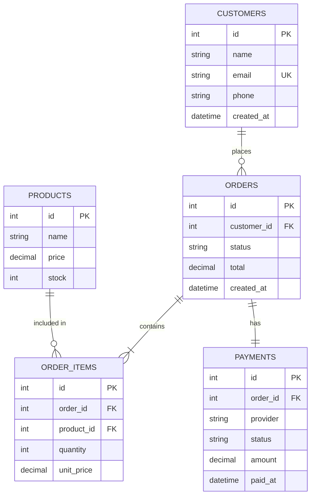
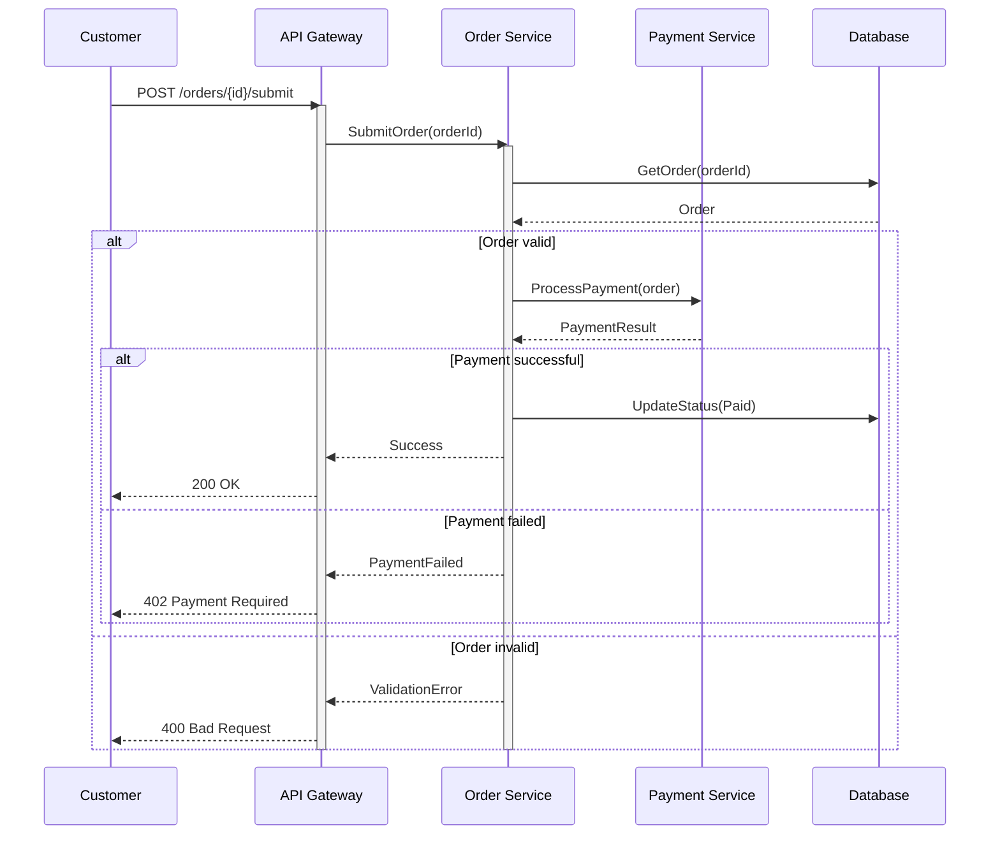
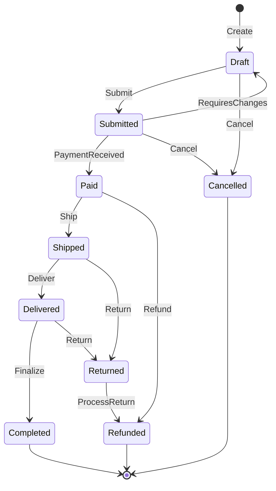
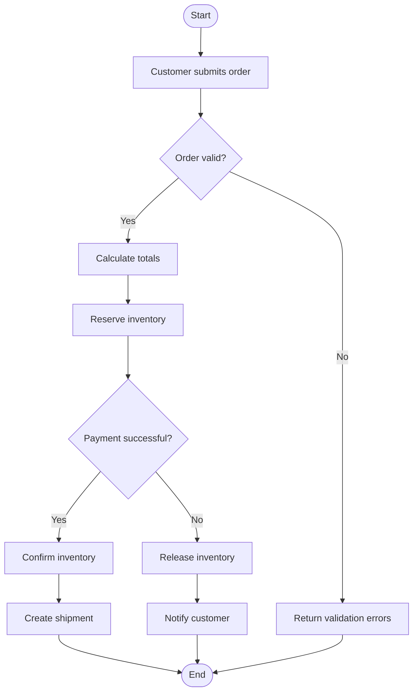
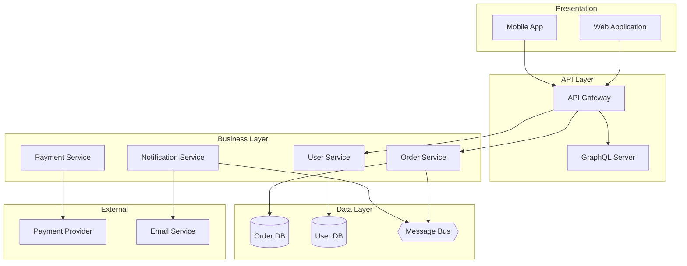

# UML Notation Guide — Mermaid

Quick reference for all UML diagram types used in the software analysis process.
All examples use **Mermaid** syntax — renders natively in GitHub, Obsidian, and most Markdown viewers.

## Diagram Selection Guide

| Need | Diagram Type | Mermaid Type | Used In Phase |
|------|--------------|--------------|---------------|
| Data structures, domain model | Class Diagram | `classDiagram` | Phase 1, 2 |
| Entity relationships, database design | ER Diagram | `erDiagram` | Phase 3 |
| API flow, protocols, interactions | Sequence Diagram | `sequenceDiagram` | Phase 5 |
| Business processes, workflows | Activity Diagram | `flowchart` | Phase 5 |
| Actor interactions, requirements | Use Case Diagram | *(not supported — use text table)* | Phase 0 |
| Lifecycle, state transitions | State Machine | `stateDiagram-v2` | Phase 4 |
| System structure, components | Component Diagram | `flowchart` with subgraphs | Phase 6 |
| As-Is / To-Be process flows | Process Flow | `flowchart` with subgraphs | Phase 5, 7 |

## Class Diagram

```mermaid
classDiagram
    class Entity {
        <<abstract>>
        +Guid Id
        +DateTimeOffset CreatedAt
        +DateTimeOffset UpdatedAt
    }

    class Order {
        -List~LineItem~ _lineItems
        +Guid CustomerId
        +OrderStatus Status
        +Money Total
        +AddItem(Product, int) Result~LineItem~
        +RemoveItem(Guid) Result
        +Submit() Result
        +Cancel() Result
    }

    class LineItem {
        +Guid ProductId
        +string ProductName
        +int Quantity
        +Money UnitPrice
        +Money LineTotal
    }

    class OrderStatus {
        <<enumeration>>
        Draft
        Submitted
        Paid
        Shipped
        Delivered
        Cancelled
    }

    class Money {
        <<value object>>
        +decimal Amount
        +string Currency
        +{static} Zero: Money
        +Add(other: Money) Money
        +Multiply(factor: decimal) Money
    }

    Entity <|-- Order
    Entity <|-- LineItem
    Order "1" *-- "0..*" LineItem : contains
    Order --> OrderStatus
    Order --> Money
    LineItem --> Money
```

### Visibility and Notation

| Symbol | Meaning |
|--------|---------|
| `+` | Public |
| `-` | Private |
| `#` | Protected |
| `~` | Package/Internal |
| `<<abstract>>` | Abstract class |
| `<<enumeration>>` | Enum |
| `<<value object>>` | Value object (DDD) |
| `<<service>>` | Service class |
| `~Type~` | Generic type (use `~` for `< >`) |

### Relationship Types

| Symbol | Type | Meaning | Example |
|--------|------|---------|---------|
| `<|--` | Inheritance | is-a (subclass extends superclass) | `Animal <|-- Dog` |
| `*--` | Composition | part-of, exclusive ownership, dies with parent | `Order "1" *-- "0..*" LineItem` |
| `o--` | Aggregation | has-a, shared ownership, survives independently | `Team "1" o-- "*" Player` |
| `-->` | Association | knows-about, uses | `Customer --> Order` |
| `..>` | Dependency | depends on (temporary, method-level) | `Controller ..> Service` |
| `..|>` | Implementation | implements interface | `UserService ..|> IUserService` |

### Cardinality

| Notation | Meaning |
|----------|---------|
| `1` | Exactly one |
| `0..1` | Zero or one (optional) |
| `*` or `0..*` | Zero or many |
| `1..*` | One or many (at least one) |
| `"1" *-- "0..*"` | One-to-many composition |

## ER Diagram



### ER Cardinality

| Symbol | Meaning |
|--------|---------|
| `||--o{` | One-to-many (mandatory one, optional many) |
| `||--||` | One-to-one (both mandatory) |
| `}|--|{` | Many-to-many |
| `o|--o{` | Zero-or-one to zero-or-many |
| `||--o\|` | One-to-zero-or-one |
| `PK` | Primary key |
| `FK` | Foreign key |
| `UK` | Unique key |

## Sequence Diagram



### Sequence Notation

| Symbol | Meaning |
|--------|---------|
| `->>` | Synchronous call (solid arrow, waits for response) |
| `-->>` | Response (dashed arrow) |
| `activate X` / `deactivate X` | Lifeline activation/deactivation |
| `alt` / `else` / `end` | Conditional branches (if/else) |
| `opt` / `end` | Optional steps (if-only) |
| `loop` / `end` | Repetition (for/while) |
| `par` / `and` / `end` | Parallel execution |
| `note over X, Y` | Annotation spanning participants |
| `note right of X` | Annotation on one participant |
| `participant X as Y` | Alias for participant |
| `autonumber` | Auto-number messages |

## State Machine Diagram



### State Machine Notation

| Symbol | Meaning |
|--------|---------|
| `[*]` | Initial state (start) or final state (end) |
| `-->` | Transition |
| `: event` | Transition triggered by event |
| `: event / action` | Event triggers action |
| `note right of X` | Annotation |
| `state X { ... }` | Composite/nested state |
| `--` | Separator between state groups |
| `<<choice>>` | Decision point (diamond) |

## Activity Diagram (Flowchart)



### Flowchart Notation

| Shape | Syntax | Meaning |
|-------|--------|---------|
| Round rect | `[text]` | Action/step |
| Diamond | `{text}` | Decision point (if/else) |
| Circle | `([text])` | Start/end |
| Cylinder | `[(text)]` | Database |
| Subgraph | `subgraph Name ... end` | Grouping (phase, layer, swimlane) |
| Arrow | `-->` | Flow direction |
| Labeled arrow | `-->|label|` | Labeled flow (branch outcome) |
| `TD` / `LR` | `flowchart TD` / `flowchart LR` | Top-down or left-right layout |

## Component Diagram



### Component Notation

| Symbol | Meaning |
|--------|---------|
| `subgraph Name ... end` | Component grouping (layer, package, system) |
| `-->` | Dependency / communication |
| `-.->` | Weak/optional dependency |
| `==>` | Strong dependency |
| `[(text)]` | Database shape |
| `{{text}}` | Hexagon shape (message bus, queue) |
| `[[text]]` | Double-rounded rect (component) |
| `[(text)]` | Cylinder (database) |

## Use Case Diagram

Mermaid does **not** support use case diagrams natively. Use a text table instead:

```markdown
## Use Case Diagram — E-Commerce System

| Actor | Use Cases |
|-------|-----------|
| Customer | Browse Products, Add to Cart, Checkout, Track Order, Request Refund |
| Warehouse Staff | Manage Inventory, Fulfill Order |
| Admin | Manage Inventory, Generate Reports |

**Relationships:**
- Checkout **includes** Add to Cart
- Request Refund **extends** Track Order
```

## Best Practices

### General

1. **One concept per diagram** — If a diagram tries to show too much, split it
2. **Consistent naming** — Use the same terms across all diagrams (ubiquitous language)
3. **Meaningful titles** — Every diagram should have a clear title or context
4. **Add notes for non-obvious** — If something needs explanation, add a `note`
5. **Keep it readable** — If a diagram has >12 elements, consider splitting

### Class Diagrams

- Don't show getters/setters — they're implementation details
- Show only methods relevant to the domain behavior
- Use stereotypes (`<<abstract>>`, `<<value object>>`) for clarity
- Don't show every relationship — only the important ones
- Use `~Type~` for generic types (Mermaid uses `~` instead of `< >`)

### Sequence Diagrams

- Show both happy path AND at least one error path
- Use `alt` blocks for branches, not separate diagrams
- Activate/deactivate participants to show processing time
- Don't show internal implementation of external systems
- Use aliases (`participant X as Y`) for long names

### State Machines

- Start with the happy path, then add error transitions
- Every state must be reachable from the initial state
- Terminal states should have no outgoing transitions
- Document guards (conditions) for complex transitions
- Use `<<choice>>` for decision points with multiple outcomes

### ER Diagrams

- Show only relevant columns — not every column needs to be in the diagram
- Use PK/FK/UK annotations for clarity
- Show cardinality on every relationship
- Include audit columns (`created_at`, `updated_at`, `deleted_at`) when relevant
- Use descriptive relationship labels (`places`, `contains`, `belongs to`)

### Component Diagrams

- Group by layer or responsibility using `subgraph`
- Show only inter-component dependencies, not internal details
- Use database/bus shapes for infrastructure components
- Label external systems clearly
- Keep dependency direction consistent (typically top-to-bottom)

## Common Mistakes

| Mistake | Fix |
|---------|-----|
| God diagram with 30+ elements | Split into focused sub-diagrams by domain area |
| No error paths in sequence diagrams | Add `alt` blocks for error cases |
| Unreachable states in state machines | Verify every state is reachable from `[*]` |
| Missing cardinality in relationships | Always specify both sides (e.g., `"1" *-- "0..*"`) |
| Mixing implementation details in conceptual diagrams | Keep it abstract — no framework types, no ORM annotations |
| Inconsistent naming across diagrams | Use the ubiquitous language glossary from Phase 1 |
| Using `< >` for generics in class diagrams | Use `~Type~` instead (Mermaid parses `< >` as HTML) |
| State machine with terminal state that has outgoing transitions | Terminal states (`[*]`) are final — no transitions out |
| Sequence diagram without activate/deactivate | Use `activate`/`deactivate` to show when participants are processing |
| ER diagram without PK/FK annotations | Always mark primary and foreign keys for clarity |
