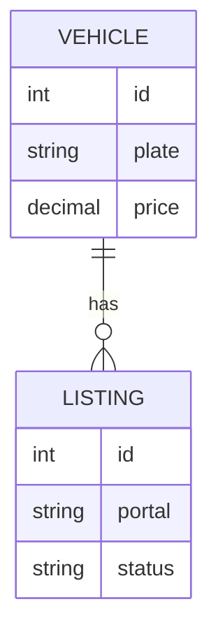

# Phase 1 — Domain Modeling

## Purpose

Identify and define the core entities of the business domain, their attributes,
relationships, and the ubiquitous language that both business and technical teams will use.

## What You Produce

`domain-model.md` — A document containing:
- List of entities with attributes and descriptions
- Relationships between entities with cardinality
- Ubiquitous language glossary
- Mermaid class diagram (conceptual, not implementation-focused)

## Input

Requirements documents from Phase 0 (SRS, User Stories, Use Cases).

## Workflow

### Step 1 — Extract Candidate Entities

Review the requirements and identify nouns that represent domain concepts:

- "In RF-01, you mention 'vehicle', 'portal', 'listing' — are these distinct things?"
- "In UC-02, 'token' appears — is this the same as the 'API key' from RF-08?"
- "You said 'the store has settings' — is 'settings' an entity or just attributes of store?"

Rules for identifying entities:
- It has independent existence (can be talked about on its own)
- It has attributes that describe it
- It participates in relationships with other entities
- It has a lifecycle (created, modified, possibly deleted)

**Validation checkpoint:** Every entity from the requirements is accounted for. If a noun appears in multiple requirements, it's either one entity or two — decide and justify.

### Step 2 — Define Attributes

For each entity, identify its attributes:

- "What information do you need to know about a [entity]?"
- "Is [attribute] always present, or can it be empty?"
- "Is [attribute] a simple value (text, number, date) or something more complex?"
- "Does [attribute] come from somewhere else, or is it defined here?"

Distinguish between:
- **Intrinsic attributes**: Inherent to the entity (name, date, value)
- **Reference attributes**: Point to another entity (foreign key conceptually)
- **Derived attributes**: Calculated from other data (total, age, status)
- **Metadata**: Created at, updated at, deleted at

**Validation checkpoint:** No attribute is ambiguous. Every attribute has a clear type (text, number, date, boolean, reference, complex). If you can't name the type, the attribute needs clarification.

### Step 3 — Define Relationships

For each pair of related entities, determine:

- "Can a [Entity A] exist without a [Entity B]?" (mandatory vs optional)
- "How many [Entity B] can a [Entity A] have?" (one, many)
- "Can a [Entity B] belong to multiple [Entity A]?" (many-to-many?)
- "If [Entity A] is deleted, what happens to its [Entity B]?" (cascade, restrict, nullify)

Cardinality notation:
- **1:1** — One to one
- **1:N** — One to many
- **N:M** — Many to many (may need an associative entity)

**Validation checkpoint:** Every relationship has cardinality on both sides and a deletion rule. If any is missing, the relationship is underspecified.

### Step 4 — Establish Ubiquitous Language

Create a glossary of domain terms:

- "What do you call this in your day-to-day? Not the technical term, the business term."
- "Is 'client' the same as 'customer'? Or different?"
- "You said 'publish' — does that mean the same thing for ML and OLX, or different?"

Document:
- Term, definition, synonyms (if any), and which entity it maps to

### Step 5 — Identify Patterns

Look for modeling patterns:

- **Hierarchy**: Category → Make → Model → Version (tree structure)
- **Status/State**: Entities with lifecycle (draft, active, archived)
- **Polymorphism**: Different types of the same concept (Payment: CreditCard, Boleto, Pix)
- **Versioning**: Things that change over time but need history (price history, contract versions)
- **Soft Delete**: Things that are "deleted" but need to be recoverable

### Step 6 — Produce the Diagram

Generate a Mermaid class diagram showing entities, attributes, and relationships:

Use `erDiagram` for conceptual entity-relationship view, or `classDiagram` for
a more object-oriented conceptual view.

**Validation checkpoint:** The diagram renders correctly, matches the text descriptions, and is readable (not overcrowded). If it has >12 entities, consider splitting into focused sub-diagrams.

## Constraints

### MUST DO

- Use the domain's terms, not technical terms (e.g., "customer" not "user_entity")
- Define cardinality for every relationship (both directions)
- Document deletion rules for every relationship (cascade, restrict, nullify)
- Create a ubiquitous language glossary with all domain terms
- Split entities that have >15 attributes into focused sub-entities

### MUST NOT DO

- Model implementation details (database types, ORM annotations, framework specifics)
- Use the same term for different concepts (e.g., "token" for both API key and OAuth token)
- Create entities that have no behavior or relationships (might be just an attribute)
- Embed complex data structures as attributes when they should be separate entities
- Accept "it depends" for cardinality — decide and document the assumption

## Good vs Bad Examples

**Bad entity:**
> `VehicleSettings` — has 3 attributes (color, font, layout) that are really just preferences of the user viewing the vehicle.

**Good entity:**
> `Vehicle` — has independent existence, lifecycle (created → published → removed), relationships (has listings, belongs to owner), and behavior (can be published, can have price changed).

**Bad relationship:**
> "Vehicle is related to Listing" — no cardinality, no deletion rule.

**Good relationship:**
> "One Vehicle has zero or more Listings (1:N). A Listing must belong to exactly one Vehicle. If a Vehicle is deleted, its Listings are soft-deleted (cascade to deleted_at)."

**Bad attribute:**
> `status` on Vehicle — but status actually belongs to the Listing (a vehicle can be published on ML but not on OLX).

**Good attribute:**
> `price` on Vehicle — intrinsic to the vehicle, doesn't vary by portal, always present.

## Completion Criteria

Before advancing to Phase 2, confirm:

- [ ] All entities from the requirements are identified
- [ ] Each entity has a complete set of attributes with clear types
- [ ] All relationships are defined with cardinality (both sides) and deletion rules
- [ ] Ubiquitous language is documented and agreed upon
- [ ] No entity is doing too much (split if it has >15 attributes)
- [ ] No attribute is ambiguous in meaning
- [ ] The diagram renders correctly and matches the text
- [ ] The user has reviewed and confirmed the domain model

## Tips

- **Don't model implementation details**: This is conceptual, not a database schema (that's Phase 3)
- **Watch for hidden entities**: "The vehicle has a status" — status might be its own entity if it has history
- **Challenge synonyms**: "Is 'ad' the same as 'listing'? If so, pick one term"
- **Look for missing entities**: If you keep saying "the thing that connects X and Y", that's probably an entity
- **Composition vs aggregation**: "If the parent dies, does the child die too?" (composition) or "can the child survive?" (aggregation)
