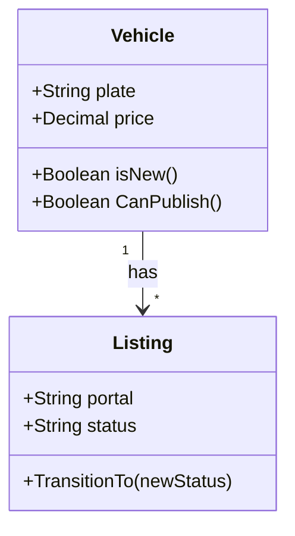

# Phase 2 — Class Diagram

## Purpose

Translate the domain model into a conceptual class diagram that shows responsibilities,
behaviors, and design patterns — still without implementation details.

## What You Produce

`class-diagram.md` — A document containing:
- UML class diagram (Mermaid) with classes, attributes, and methods
- Responsibility description for each class
- Identified design patterns and where they apply
- Notes on inheritance, composition, and aggregation

## Input

Domain model from Phase 1.

## Workflow

### Step 1 — From Entities to Classes

Review each entity from the domain model and determine its responsibilities:

- "What does a [Entity] do? Not what's done to it, what does it do itself?"
- "What behaviors belong naturally to this class?"
- "Does this class have rules it must enforce about its own data?"
- "What can this class tell you about itself?"

A class has three kinds of members:
- **Attributes** (data it holds) — already defined in Phase 1
- **Methods** (behaviors it performs) — what you're discovering now
- **Relationships** (other classes it knows about) — already defined in Phase 1

**Validation checkpoint:** Every class has at least one behavior (method). If a class only has attributes, it's an anemic model — either add behavior or reconsider if it should be a simple data structure.

### Step 2 — Identify Responsibilities

For each class, list what it's responsible for:

- **Validation**: "A Vehicle knows whether its data is complete enough to publish"
- **State transitions**: "A Listing knows which status changes are valid"
- **Calculations**: "An Order knows how to calculate its total"
- **Formatting**: "A Person knows how to format its name for display"
- **Queries**: "A Catalog knows how to find items matching criteria"

Ask the user:
- "If you had to explain what a [class] does to someone new, what would you say?"
- "What would be surprising if this class couldn't do?"
- "What would be surprising if this class could do?"

**Validation checkpoint:** You can answer "what does it do, how do you use it, what does it depend on?" for every class. If any answer is unclear, the class boundary needs work.

### Step 3 — Identify Design Patterns

Look for opportunities where established patterns apply:

- **Adapter**: "We need to talk to ML and OLX differently but through the same interface"
- **Strategy**: "The pricing calculation changes based on the product type"
- **Observer**: "When a listing changes status, multiple things need to react"
- **Factory**: "We create vehicles differently depending on the source"
- **Repository**: "We need to abstract how vehicles are stored and retrieved"
- **Decorator**: "We add features to a base listing (featured, urgent, etc.)"
- **State**: "The listing behavior changes based on its current status"

For each pattern identified:
- Explain why it applies
- Show how it would look in the diagram
- Note what problem it solves

**Validation checkpoint:** Every pattern is justified by a real problem, not added for elegance. If you can't explain the problem it solves, don't use it.

### Step 4 — Define Relationships Precisely

Refine the relationships from the domain model:

- **Inheritance** (is-a): "A Car is a Vehicle" — shared behavior, specialized behavior
- **Composition** (part-of, dies with parent): "An Address is part of a Store"
- **Aggregation** (has-a, survives independently): "A Store has many Vehicles"
- **Association** (knows-about): "A Listing knows about a Portal"
- **Dependency** (uses): "A VehicleService uses a CatalogService"

### Step 5 — Produce the Diagram

Generate a Mermaid class diagram:



Notation:
- `+` public, `-` private, `#` protected
- `*` many, `1` one, `0..1` zero or one
- `-->` association, `--|>` inheritance, `*--` composition, `o--` aggregation

**Validation checkpoint:** The diagram is readable (not overcrowded). If it has >10 classes, consider splitting into focused sub-diagrams by domain area.

## Constraints

### MUST DO

- Give every class a clear responsibility statement (one sentence)
- Identify design patterns only when they solve a real problem
- Use "Tell, Don't Ask" — prefer methods on the class that owns the data
- Keep class diagrams conceptual — no getters/setters, no framework annotations
- Split classes that have >7 methods (Single Responsibility Principle)

### MUST NOT DO

- Add implementation details (framework types, ORM mappings, database columns)
- Use patterns for the sake of elegance — only when they solve a problem
- Create anemic classes (only attributes, no behavior) without justification
- Mix concerns in one class (e.g., validation + persistence + formatting)
- Show every relationship — only show relationships relevant to the current analysis

## Good vs Bad Examples

**Bad class (God Class):**
```
class Vehicle {
    +validate()
    +publish()
    +saveToDatabase()
    +formatForML()
    +formatForOLX()
    +sendEmail()
    +calculateTax()
    +generatePDF()
}
```
Too many responsibilities. Split into focused classes.

**Good class (Single Responsibility):**
```
class Vehicle {
    +Boolean canPublish()
    +Boolean isNew()
}
class VehiclePublisher {
    +publish(portal)
}
class VehicleFormatter {
    +formatForML()
    +formatForOLX()
}
```
Each class has one clear responsibility.

**Bad pattern usage:**
> "Let's use Factory pattern for creating vehicles" — when there's only one way to create a vehicle.

**Good pattern usage:**
> "Let's use Factory pattern for creating vehicles because we have different creation flows: manual entry, CSV import, API sync — each needs different validation and defaults."

## Completion Criteria

Before advancing to Phase 3, confirm:

- [ ] Every class has clear responsibilities documented
- [ ] All design patterns are identified and justified
- [ ] Relationship types (inheritance, composition, aggregation) are correct
- [ ] No class has too many responsibilities (split if >7 methods)
- [ ] The diagram is readable and not overcrowded
- [ ] The user understands and agrees with the class structure

## Tips

- **Tell, don't ask**: Prefer methods on the class that owns the data, not external code querying and manipulating
- **Single Responsibility**: If a class does two unrelated things, it should probably be two classes
- **Patterns are tools, not goals**: Only use a pattern if it solves a real problem in the domain
- **Keep it conceptual**: Don't add getters/setters, ORM annotations, or framework-specific details
