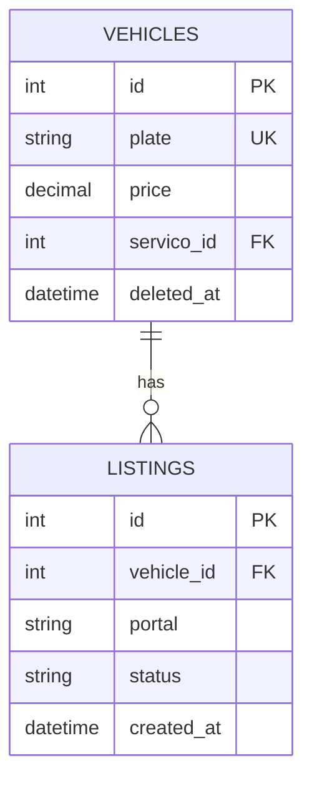

# Phase 3 — Database Design

## Purpose

Translate the conceptual class model into a logical database design — tables, columns,
relationships, constraints, and indexes — while maintaining data integrity.

## What You Produce

`database-design.md` — A document containing:
- Conceptual ERD (Mermaid)
- Table definitions with columns, types, constraints
- Normalization analysis
- Index strategy
- Notes on soft delete, auditing, and data integrity

## Input

Class diagram from Phase 2.

## Workflow

### Step 1 — Map Classes to Tables

For each class, determine how it maps to a table:

- "Does every class need its own table, or can some be embedded?"
- "Is this a 1:1 relationship that could be a single table?"
- "Does this N:M relationship need a junction table?"

Rules:
- Each entity with its own identity gets a table
- Composition relationships may be embedded (JSON column) or separate tables
- N:M relationships always need a junction table
- Inheritance: single table with type column, or separate tables per subclass

**Validation checkpoint:** Every table has a clear reason to exist independently. If a table is always accessed with its parent and has no independent queries, consider embedding.

### Step 2 — Define Columns

For each table, define columns:

- **Primary key**: What uniquely identifies each row? (surrogate vs natural key)
- **Foreign keys**: Which columns reference other tables?
- **Data types**: What kind of data goes in each column?
- **Nullable**: Can this column be empty? Why or why not?
- **Defaults**: What value if none is provided?
- **Constraints**: What rules must the data satisfy?

Ask the user:
- "Can this field be empty? Under what circumstances?"
- "Is there a maximum length? A valid range?"
- "Should this be unique? Across the whole table, or within a group?"
- "Does this need to be a specific format? (email, phone, URL)"

**Validation checkpoint:** Every column has a type, nullability decision, and justification. No column exists without a known consumer.

### Step 3 — Normalize

Apply normalization principles:

- **1NF**: Each column holds a single value (no arrays, no repeated groups)
- **2NF**: Every non-key column depends on the full primary key
- **3NF**: No column depends on another non-key column

Ask:
- "Is any column storing multiple values in one field?"
- "Does any column's value depend on another column rather than the key?"
- "If this value changes, would it need to change in multiple rows?"

Note: Sometimes denormalization is intentional for performance. Document these cases explicitly.

**Validation checkpoint:** The design is at least in 3NF. Any intentional denormalization is documented with rationale and the query it optimizes.

### Step 4 — Define Constraints

Business rules that can be enforced at the database level:

- **NOT NULL**: Required fields
- **UNIQUE**: Fields that must be unique (plates, emails, codes)
- **CHECK**: Value constraints (price > 0, km >= 0, status in allowed values)
- **FOREIGN KEY**: Referential integrity (a listing must reference an existing vehicle)
- **DEFAULT**: Default values (status = 'pending', created_at = now())

**Validation checkpoint:** Every business rule that can be enforced at the database level has a corresponding constraint. If a rule is only enforced in application code, document why.

### Step 5 — Plan Indexes

Identify columns that need indexes for query performance:

- **Foreign keys**: Almost always need indexes (joins, lookups)
- **Search columns**: Columns used in WHERE clauses (status, portal, date ranges)
- **Unique columns**: Unique constraints automatically create indexes
- **Composite indexes**: Columns frequently queried together (portal + status)

Ask:
- "What queries will be most common?"
- "What filters will be applied most often?"
- "Are there queries that combine multiple conditions?"

### Step 6 — Special Considerations

- **Soft delete**: "When something is 'deleted', should it be recoverable?" → `deleted_at` column
- **Auditing**: "Do you need to track who created/modified each record?" → `created_by`, `updated_by`, or audit log
- **Multi-tenancy**: "Does each client see only their own data?" → `tenant_id` on every table
- **Versioning**: "Do you need to keep history of changes?" → audit table or version column
- **Encryption**: "Are there sensitive fields that need encryption at rest?"

**Validation checkpoint:** Soft delete, auditing, and multi-tenancy decisions are documented. Every table that needs them has the appropriate columns.

### Step 7 — Produce the Diagram

Generate a Mermaid ERD:

**Validation checkpoint:** The ERD renders correctly, all foreign keys reference valid tables, and the diagram matches the table definitions exactly.

## Constraints

### MUST DO

- Define a primary key for every table
- Define foreign keys for all inter-table relationships
- Define NOT NULL constraints for all required fields
- Define UNIQUE constraints for all unique fields
- Include `created_at` and `updated_at` on every table
- Document the index strategy with the queries it optimizes
- Decide and document soft delete approach (yes/no, column name)

### MUST NOT DO

- Use JSON columns for data that needs to be queried or constrained
- Skip foreign key constraints "for performance" without measuring
- Use natural keys when a surrogate key would be simpler
- Denormalize without documenting the query it optimizes
- Mix data types (e.g., store dates as strings, numbers as text)
- Create indexes without knowing the queries they'll serve

## Good vs Bad Examples

**Bad table design:**
> `vehicles` table with `photos` column storing `["url1", "url2", "url3"]` as JSON — but you need to query "vehicles with more than 3 photos".

**Good table design:**
> `vehicle_photos` table with `vehicle_id`, `url`, `order` — queryable, constrainable, indexable.

**Bad constraint:**
> No constraint on `status` column — application code validates, but bad data can slip in via direct database access.

**Good constraint:**
> `CHECK (status IN ('pending', 'publishing', 'published', 'failed', 'paused', 'removed'))` — database enforces valid values.

**Bad index:**
> Index on `created_at` "just in case" — no query uses it.

**Good index:**
> Composite index on `(portal, status)` — optimizes the most common query: "find all published listings for portal X".

## Completion Criteria

Before advancing to Phase 4, confirm:

- [ ] Every table has a primary key
- [ ] All foreign keys are defined and reference valid tables
- [ ] All NOT NULL constraints are justified by business rules
- [ ] All UNIQUE constraints are identified
- [ ] Index strategy covers the most common queries
- [ ] Soft delete / auditing approach is decided
- [ ] The ERD renders correctly and matches the table definitions
- [ ] Normalization is at least 3NF (with documented exceptions)

## Tips

- **Surrogate keys**: Use auto-increment or UUID for primary keys unless there's a strong natural key
- **JSON columns**: Good for flexible data (addresses, metadata), bad for querying and constraints
- **Enum columns**: Use CHECK constraints to limit values, not just documentation
- **Timestamps**: Always include `created_at` and `updated_at` — you'll want them later
- **Naming**: Use consistent naming (singular table names, snake_case columns)
