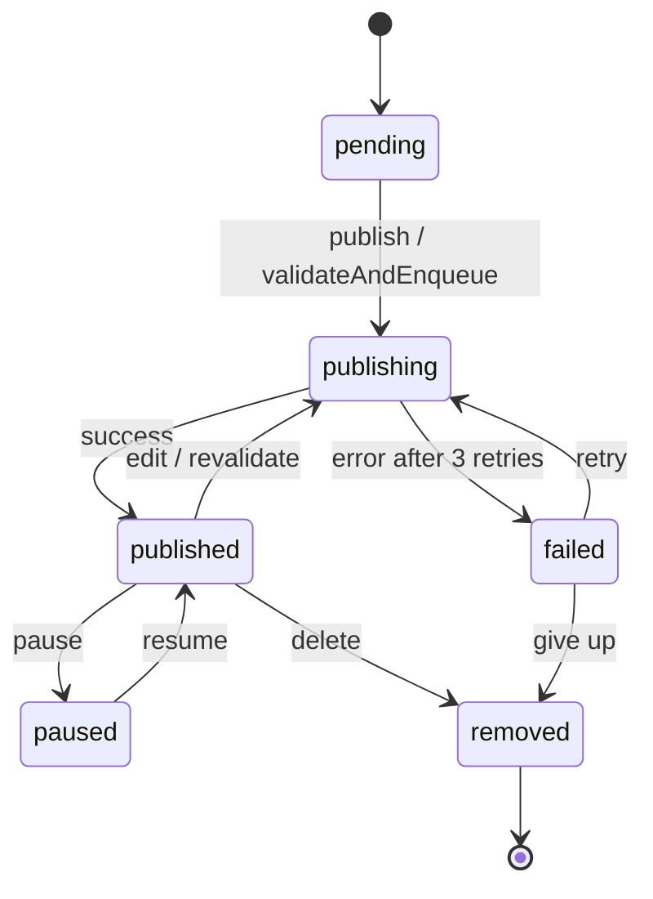

# Phase 4 — State Machine

## Purpose

Identify entities with lifecycles and model their valid states, transitions, events,
and guards. This prevents invalid state changes and documents business rules about flow.

## What You Produce

`state-machines.md` — A document containing:
- One state machine diagram per entity with a lifecycle (Mermaid)
- Transition table: from-state, to-state, event, guard, action
- Notes on invalid transitions and why they're blocked

## Input

Requirements (Phase 0) and domain model (Phase 1).

## Workflow

### Step 1 — Identify Entities with Lifecycles

Not every entity has a state machine. Look for entities that:

- Change status over time (order, payment, listing, user account)
- Go through a process (approval workflow, publishing pipeline)
- Have a clear beginning and possibly an end
- Have rules about what can happen next

Ask:
- "Which things in your system have a 'status' or 'stage'?"
- "Are there things that go through a process with steps?"
- "Are there things that can be 'undone' or 'reversed'?"

**Validation checkpoint:** Every entity with a status field has been considered for a state machine. If you decided it doesn't need one, document why.

### Step 2 — Map States

For each entity with a lifecycle, identify all possible states:

- "When it's first created, what state is it in?"
- "What are all the possible states it can be in?"
- "Is there a final state? (completed, cancelled, archived)"
- "Can it be in more than one state at once?" (if yes, you might need multiple state machines)

Common state categories:
- **Initial**: The starting state (draft, pending, new)
- **Intermediate**: States during the process (processing, in-review, publishing)
- **Terminal**: End states that can't transition further (completed, cancelled, failed)
- **Reversible**: States you can return from (paused → active)
- **Irreversible**: States you can't leave (deleted, archived)

**Validation checkpoint:** Every state is reachable from the initial state. If a state can't be reached, it's either dead code or the transitions are missing.

### Step 3 — Map Transitions

For each state, determine what can happen next:

- "From [state], what events can cause a change?"
- "What makes it move to the next state? (user action, time, external event)"
- "Can it go back to a previous state? Always? Never? Under what conditions?"
- "Can it skip states? Go directly from A to C?"

Ask:
- "What if the user tries to do X while it's in state Y? Should that be allowed?"
- "What if an external system sends an event that doesn't match the current state?"

**Validation checkpoint:** Every state has at least one outgoing transition (except terminal states). If a state has no way out and isn't terminal, it's a trap state — intentional or bug?

### Step 4 — Define Guards and Actions

For each transition:

- **Event**: What triggers the transition? (user clicks, time passes, webhook arrives)
- **Guard**: What conditions must be true for the transition to happen? (has payment, is owner)
- **Action**: What happens during the transition? (send email, update timestamp, call API)

Example:
```
Transition: pending → publishing
  Event: User clicks "Publish"
  Guard: Vehicle has at least 1 photo AND price > 0 AND OAuth token is active
  Action: Set status to "publishing", enqueue PublishJob, log audit entry
```

### Step 5 — Identify Invalid Transitions

Document transitions that should never happen and why:

- "Can it go from pending directly to removed? Why or why not?"
- "Can a cancelled order be reactivated? Should it?"
- "What if someone tries to publish an already-published listing?"

These are as important as valid transitions — they define the boundaries of the system.

### Step 6 — Handle Errors and Edge Cases

- "What happens if a transition fails halfway? Does it roll back or stay in limbo?"
- "Is there a timeout? (if publishing takes too long, does it auto-fail?)"
- "Can the same event happen twice? Is the transition idempotent?"
- "What if the system crashes during a transition?"

**Validation checkpoint:** Every transition has error handling defined. If a transition can fail, there's a path to a known state (retry, rollback, or explicit failure state).

### Step 7 — Produce the Diagrams

Generate Mermaid state diagrams for each entity:



Notation:
- `[*]` initial/final state
- `-->` transition
- Label: `event / action` or just `event`
- `note right of X` for annotations
- `state X { ... }` for composite states

**Validation checkpoint:** The diagram matches the transition table exactly. Every transition in the table appears in the diagram and vice versa.

## Constraints

### MUST DO

- Map a state machine for every entity with a status/lifecycle
- Define guards for transitions with conditions
- Document invalid transitions with reasons
- Define error handling for every transition
- Ensure every state is reachable from the initial state
- Ensure every non-terminal state has at least one outgoing transition

### MUST NOT DO

- Create state machines for entities without a lifecycle (just use a boolean)
- Allow transitions that bypass business rules without guards
- Leave transitions without error handling
- Create states that are never reachable
- Mix independent lifecycles in one state machine (split them)
- Assume transitions are idempotent without verifying

## Good vs Bad Examples

**Bad state machine:**
> `pending → published` directly, with no `publishing` state. If the publish takes 30 seconds, what status does the user see during that time?

**Good state machine:**
> `pending → publishing → published`. The `publishing` state tells the user "your request is being processed."

**Bad transition:**
> `published → removed` without any guard. Anyone can remove any published listing.

**Good transition:**
> `published → removed` with guard "user is owner OR user is admin". Action: "log audit entry, notify webhooks."

**Bad error handling:**
> "If publish fails, the listing stays in `publishing` forever."

**Good error handling:**
> "If publish fails after 3 retries, transition to `failed` with error message. User can retry manually."

## Completion Criteria

Before advancing to Phase 5, confirm:

- [ ] Every entity with a lifecycle has a state machine
- [ ] All states are identified and named consistently
- [ ] All transitions are documented with events
- [ ] Guards are defined for transitions with conditions
- [ ] Invalid transitions are documented with reasons
- [ ] Error handling is considered for each transition
- [ ] The user has validated the state machines against real scenarios

## Tips

- **Start simple**: Map the happy path first, then add alternatives and error cases
- **Watch for hidden states**: "What about 'in progress' — is that different from 'pending'?"
- **Terminal states are final**: Once in a terminal state, no transitions out (by definition)
- **Parallel states**: If an entity has two independent lifecycles, model them separately
- **State explosion**: If you have >10 states, consider if some can be merged or if the entity is doing too much
