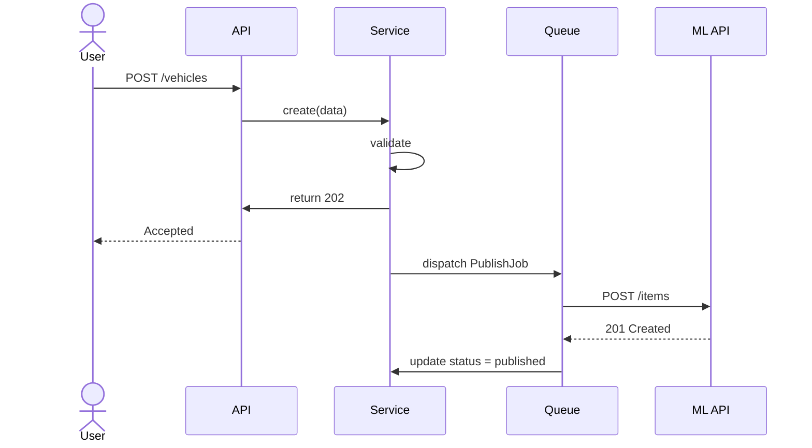
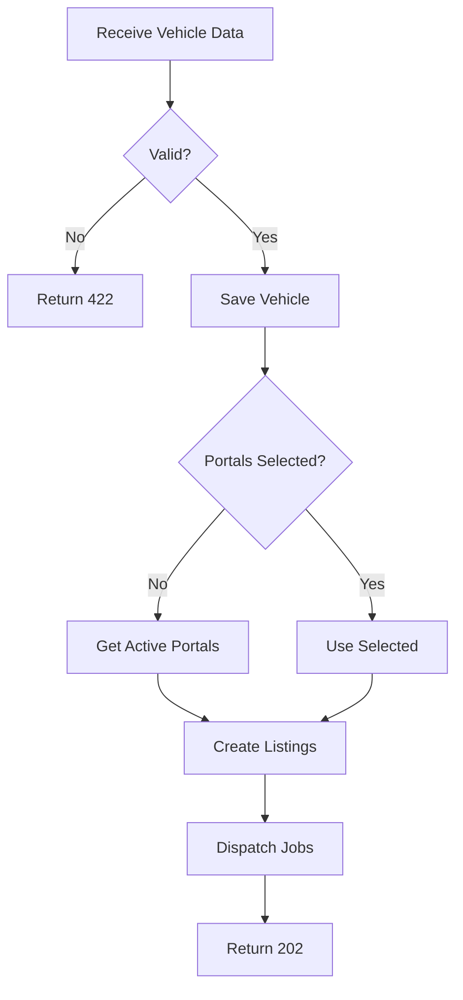
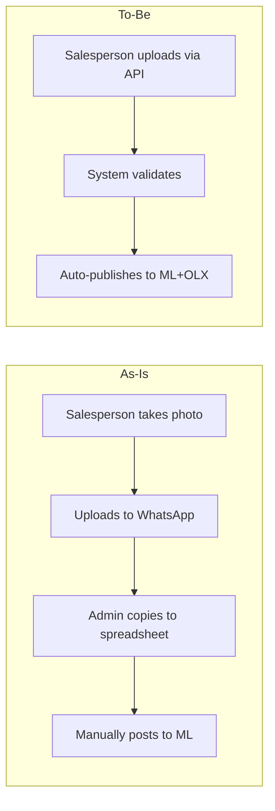

# Phase 5 — Flow Diagram

## Purpose

Model how the system's components interact over time to accomplish each use case,
and how business processes change from the current state (As-Is) to the future state (To-Be).

## What You Produce

| Document | Content |
|----------|---------|
| `flows/sequence-diagrams.md` | UML sequence diagrams for critical use cases |
| `flows/activity-diagrams.md` | Activity diagrams for complex workflows |
| `flows/process-flows.md` | BPMN-style As-Is and To-Be process flows |

## Input

Use cases (Phase 0), state machines (Phase 4), class diagram (Phase 2).

## Workflow

### Step 1 — Select Critical Flows

Not every use case needs a sequence diagram. Prioritize:

- Flows involving multiple components or external systems
- Flows with asynchronous operations
- Flows with error handling and retry logic
- Flows that are central to the business value

Ask:
- "Which flows are the most important to get right?"
- "Which flows involve the most moving parts?"
- "Which flows are the most error-prone today?"

**Validation checkpoint:** Every Must-have use case has at least one flow diagram. If a Must-have use case is missing a diagram, justify why.

### Step 2 — Sequence Diagrams

For each critical flow, model the interaction between participants over time:

- **Who are the participants?** (actors, system components, external services)
- **What messages are exchanged?** (requests, responses, events)
- **What is synchronous vs asynchronous?** (wait for response vs fire and forget)
- **Where are the decision points?** (if/else branches)
- **What happens on error?** (alternative flows)

Generate Mermaid sequence diagrams:

Notation:
- `->>` synchronous call (wait for response)
- `-->>` response
- `->>` async (fire and forget)
- `alt` / `else` / `end` for branches
- `loop` for retries
- `opt` for optional steps
- `par` for parallel execution

**Validation checkpoint:** Every sequence diagram shows both the happy path AND at least one error path. If error handling isn't shown, the diagram is incomplete.

### Step 3 — Activity Diagrams

For complex workflows with multiple paths, model the flow of activities:

- **What are the steps?** (actions, decisions, parallel branches)
- **Where are the decisions?** (forks, merges)
- **What can happen in parallel?**
- **Where does the flow end?** (success, failure, cancellation)

Generate Mermaid activity diagrams:

### Step 4 — Process Flows (As-Is and To-Be)

Map the business process before and after the software:

**As-Is (current state):**
- "How does this work today without the software?"
- "Who does what? How do they communicate? Where are the bottlenecks?"
- "What manual steps exist? What spreadsheets are used?"

**To-Be (future state with software):**
- "How will this work with the new system?"
- "What steps are automated? What still requires human action?"
- "Where are the handoffs between system and people?"

Generate Mermaid flowcharts for both:

**Validation checkpoint:** The To-Be flow explicitly shows what changed from As-Is: eliminated steps, automated steps, new steps. If you can't articulate the delta, the flow isn't clear enough.

### Step 5 — Data Flow Analysis

For each flow, identify what data moves where:

- "What data enters the system at this point?"
- "What data is transformed? How?"
- "What data leaves the system? To whom?"
- "What data is stored? For how long?"

**Validation checkpoint:** Every data input has a known source. Every data output has a known consumer. No data appears or disappears without explanation.

## Constraints

### MUST DO

- Model both happy path AND error paths for every critical flow
- Clearly mark synchronous vs asynchronous interactions
- Show external systems as participants in sequence diagrams
- Create As-Is AND To-Be process flows for every major business process
- Include timeout and retry logic in flows that involve external systems

### MUST NOT DO

- Model every use case — focus on critical flows only
- Show internal implementation details of external systems
- Assume synchronous when the operation is async (or vice versa)
- Create diagrams with >15 participants — split into focused sub-flows
- Skip error flows — they're often where the real complexity lives

## Good vs Bad Examples

**Bad sequence diagram:**
> Only shows the happy path. No error handling, no timeouts, no retries.

**Good sequence diagram:**
> Shows happy path, then uses `alt` blocks for error cases: "If ML API returns 429, wait and retry. If fails 3 times, mark as failed and notify."

**Bad process flow:**
> As-Is: "They post vehicles." To-Be: "The system posts vehicles." — No detail on what changed.

**Good process flow:**
> As-Is: 5 manual steps across 3 people, 2 hours total. To-Be: 1 API call, 30 seconds, automated validation. Steps eliminated: WhatsApp upload, spreadsheet copy, manual ML form.

## Completion Criteria

Before advancing to Phase 6, confirm:

- [ ] All critical use cases have sequence diagrams
- [ ] Complex workflows have activity diagrams
- [ ] As-Is and To-Be processes are documented
- [ ] Synchronous vs asynchronous interactions are clear
- [ ] Error flows are modeled, not just happy paths
- [ ] Data flow is understood for each interaction
- [ ] The user has validated the flows against real scenarios

## Tips

- **One flow at a time**: Don't try to model everything in one diagram
- **Happy path first**: Model the ideal flow, then add alternatives
- **External systems as black boxes**: Don't model their internals, just their interface
- **Time matters**: Sequence diagrams show order, not duration — but note where delays are expected
- **Async boundaries**: Clearly mark where the flow becomes asynchronous (the caller doesn't wait)
