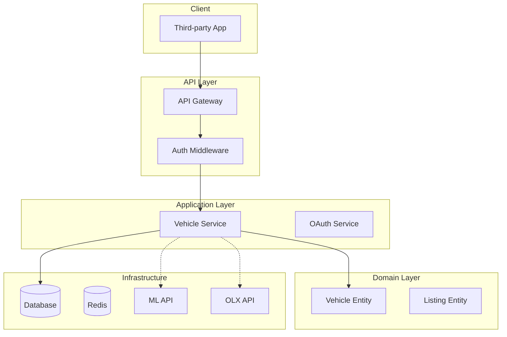

# Phase 6 — Architecture Design

## Purpose

Define the high-level structure of the system — its components, layers, boundaries,
and how they communicate — without committing to specific technologies.

## What You Produce

`architecture-design.md` — A document containing:
- Component diagram (Mermaid)
- Layered architecture description
- Integration boundaries with external systems
- Architecture Decision Records (ADRs)
- Identified single points of failure and mitigation

## Input

Class diagram (Phase 2), flow diagrams (Phase 5).

## Workflow

### Step 1 — Identify Components

Group classes and responsibilities into logical components:

- "Which classes work together to achieve a common purpose?"
- "What can be developed and deployed independently?"
- "Where are the natural boundaries in the system?"

Common component types:
- **Presentation**: Handles user interaction (API, UI, CLI)
- **Application**: Orchestrates use cases (services, controllers)
- **Domain**: Business logic and rules (entities, value objects)
- **Infrastructure**: External concerns (database, APIs, file system)

**Validation checkpoint:** Every class from Phase 2 belongs to exactly one component. If a class doesn't fit anywhere, the component boundaries need adjustment.

### Step 2 — Define Layers

Organize components into layers with clear responsibilities:

- **What does each layer do?** (its responsibility)
- **What can each layer depend on?** (dependency direction)
- **What is not allowed?** (e.g., domain layer cannot depend on infrastructure)

Ask:
- "If we changed the database, which layers would be affected?"
- "If we added a new API, which layers would change?"
- "Where is the business logic? Is it mixed with infrastructure code?"

**Validation checkpoint:** Dependencies flow in one direction (typically inward: infrastructure → application → domain). If there are circular dependencies between layers, the architecture needs restructuring.

### Step 3 — Map External Integrations

Identify all external systems and how the system interacts with them:

- "What external APIs does the system call?"
- "What external systems call into this system? (webhooks, callbacks)"
- "What is the communication pattern? (REST, events, file transfer)"
- "What happens if the external system is unavailable?"
- "Is the integration synchronous or asynchronous?"

For each integration, document:
- Direction (outbound/inbound)
- Protocol (HTTP, message queue, file)
- Data format (JSON, XML, CSV)
- Authentication method
- Error handling strategy
- Rate limits and quotas

**Validation checkpoint:** Every external integration has a documented fallback strategy. If the external system is down, the system either degrades gracefully or fails with a clear error.

### Step 4 — Choose Architectural Patterns

Identify the patterns that fit the system:

- **Monolithic**: Single deployable unit, simple to develop and deploy
- **Modular Monolith**: Single deployable unit, clear internal boundaries
- **Microservices**: Independent deployable units, complex infrastructure
- **Hexagonal/Clean**: Domain at center, adapters on the outside
- **Event-Driven**: Components communicate via events, not direct calls
- **CQRS**: Separate read and write models for different access patterns

Ask:
- "How complex is the system? Does it justify microservices?"
- "Will different parts scale differently?"
- "Will different teams work on different parts?"
- "What's the deployment frequency for each part?"

**Validation checkpoint:** The chosen pattern is justified by actual requirements, not hypothetical future scale. If the system could be a modular monolith, don't choose microservices.

### Step 5 — Identify Cross-Cutting Concerns

What applies across the entire system?

- **Authentication/Authorization**: Who can do what?
- **Logging/Auditing**: What gets recorded? Where?
- **Error Handling**: How are errors caught and reported?
- **Caching**: What data is cached? For how long? With what strategy?
- **Validation**: Where does validation happen? (input, business, output)
- **Monitoring**: What metrics are tracked? What alerts are set?

### Step 6 — Produce the Diagram

Generate a Mermaid component diagram:



### Step 7 — Write ADRs

For each significant architectural decision, write an Architecture Decision Record:

```
## ADR-XX: [Title]
**Status:** Accepted
**Context:** [What is the issue we're facing?]
**Decision:** [What did we decide?]
**Alternatives Considered:**
- [Option A] — pros and cons
- [Option B] — pros and cons
**Consequences:** [What are the trade-offs?]
```

**Validation checkpoint:** Every significant decision has an ADR. If a decision was made without considering alternatives, go back and document what was considered and why it was rejected.

## Constraints

### MUST DO

- Document all significant decisions with ADRs
- Define explicit fallback strategies for every external integration
- Evaluate trade-offs, not just benefits, for every architectural choice
- Plan for failure modes in every component
- Identify single points of failure with mitigation plans
- Keep dependencies flowing in one direction (no circular dependencies)

### MUST NOT DO

- Over-engineer for hypothetical scale
- Choose technology without evaluating alternatives
- Design without understanding the non-functional requirements
- Skip security considerations
- Create a distributed monolith (microservices that always call each other synchronously)
- Ignore operational costs and complexity

## Good vs Bad Examples

**Bad architecture decision:**
> "We'll use microservices because that's what modern apps use." — No justification, no evaluation of alternatives.

**Good architecture decision:**
> "We'll use a modular monolith because: (1) single team, (2) <100 requests/sec expected, (3) clear internal boundaries via adapters. We can split to microservices later if team grows or load increases."

**Bad integration design:**
> "We call the ML API. If it fails, we return an error." — No retry, no timeout, no fallback.

**Good integration design:**
> "We call the ML API with 5s timeout. On failure, retry 3 times with exponential backoff. If all retries fail, queue the request for later processing and return 202 Accepted to the user."

## Completion Criteria

Before advancing to Phase 7, confirm:

- [ ] All components are identified and their responsibilities are clear
- [ ] Layer boundaries are defined and respected
- [ ] All external integrations are documented with error handling
- [ ] Architectural pattern is chosen and justified
- [ ] Cross-cutting concerns are addressed
- [ ] ADRs exist for all significant decisions
- [ ] Single points of failure are identified with mitigation plans

## Tips

- **Start with a modular monolith**: It's easier to split later than to merge
- **Dependencies flow inward**: Infrastructure depends on domain, not the other way
- **Explicit boundaries**: If two components communicate, document how and why
- **Plan for failure**: Every external dependency can fail — plan for it
- **Don't over-engineer**: The simplest architecture that meets the requirements is the right one
